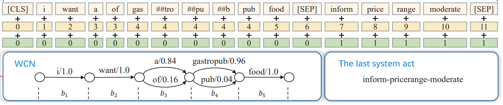

# WCN-BERT

Jointly encoding word confusion networks (WCNs) and dialogue context with BERT for spoken language understanding (SLU). The [paper](https://arxiv.org/pdf/2005.11640.pdf) is submitted to [INTERSPEECH 2020](http://www.interspeech2020.org/).

## 0. Setup

```bash
pip3 install -r requirements.txt
```

## 1. Data

We conduct our experiments on a benchmark SLU dataset, **DSTC2**. Origin data can be obtained [HERE](http://camdial.org/~mh521/dstc/).

The data is preprocessed and saved in `dstc2_data/processed_data/*`, where each line is a data sample in the form of:

```
<system act seq>\t<=>\t<wcn seq>\t<=>\t<labels>
```

The WCNs and system acts are flattened into a sequence as the figure below shows:



## 2. Experiments

For the experiments with only WCNs, we convert the WCNs into sequences and fed into BERT. For the experiments with WCNs and the last system act, they are flattened into one sequence (see above).

We use both discriminative (STC) and generative (TFHD) approaches for the output module:

- STC (**S**emantic **T**uple **C**lassifier): The `act`, `slot` and `value` are classified in a hierarchical order.
- TFHD (**T**rans**F**ormer-based **H**ierarchical **D**ecoder): We adopt the method from [this paper](https://arxiv.org/pdf/1904.04498.pdf). The hierarchical model builds classifiers for the `acts` and `slots`, and generate values with a sequence-to-sequence model with pointer network. We make two  changes as follows:
  - Change the backbone model from LSTM to Transformer;
  - Embed the `acts` and `slots` with BERT. 

Recommended hyper-parameters have been given in the scripts, and you can adjust them according to your needs. 

### 2.1 WCN + System Act + STC

- train the model

  ```bash
  ./run/train_wcn_STC_SA_BERT.sh
  ```

- test the model

  ```bash
  ./run/test_wcn_STC_SA_BERT.sh
  ```

### 2.2 WCN + System Act + TFHD

- train the model

  ```bash
  ./run/train_wcn_TFHD_SA_BERT.sh
  ```

- test the model

  ```bash
  ./run/test_wcn_TFHD_SA_BERT.sh
  ```

### 2.3 WCN + STC

- [ ] TODO

### 2.4 WCN + TFHD

- [ ] TODO

## 3. Citation

If you use our models, please cite the following papers:

```
@article{liu2020jointly,
  title={Jointly Encoding Word Confusion Network and Dialogue Context with BERT for Spoken Language Understanding},
  author={Liu, Chen and Zhu, Su and Zhao, Zijian and Cao, Ruisheng and Chen, Lu and Yu, Kai},
  journal={arXiv preprint arXiv:2005.11640},
  year={2020}
}
```

